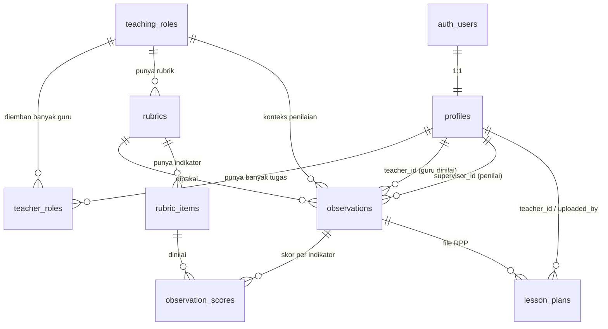

# Skema Database — Teacher Supervisor

Database: **Supabase (PostgreSQL)**. Semua tabel di schema `public`.
Sumber DDL: [`schema.sql`](schema.sql).

Total: **8 tabel**, 1 enum, 1 bucket Storage, 1 helper function, 1 trigger.

> **Desain penting 1:** tiap guru punya akun login, jadi data guru **digabung ke `profiles`**
> (tidak ada tabel `teachers` terpisah). Baris `profiles` dengan `role='guru'` sekaligus
> menyimpan mata pelajaran & kelas. Kolom `observations.teacher_id` & `lesson_plans.teacher_id`
> menunjuk ke `profiles(id)`.
>
> **Desain penting 2:** seorang guru bisa mengemban banyak **tugas** (Guru Mata Pelajaran, Wali Kelas,
> Guru Piket, … — 13 jenis), dan **tiap tugas punya rubriknya sendiri**. Tugas disimpan di
> tabel `teaching_roles` (data, bukan enum — beda dari `user_role` yang mengatur hak akses).
> Relasi guru⇄tugas lewat `teacher_roles`. Satu observasi = satu tugas: `observations.teaching_role_id`
> menentukan konteks, dan `rubric_id` diambil dari rubrik aktif tugas tersebut.

---

## Diagram Relasi

---

## Enum

| Nama | Nilai |
|---|---|
| `user_role` | `supervisor`, `guru`, `admin` |

---

## 1. `profiles`
Akun user aplikasi (1:1 dengan `auth.users`) **sekaligus data guru**. Dibuat otomatis saat user daftar (trigger `handle_new_user`). Supervisor/admin: kolom `subject`/`class_name` dikosongkan; guru: diisi.

| Kolom | Tipe | Keterangan |
|---|---|---|
| `id` | uuid **PK** | FK → `auth.users(id)`, cascade delete |
| `email` | text | wajib |
| `full_name` | text | nama lengkap |
| `role` | `user_role` | default `guru` |
| `subject` | text | mata pelajaran (untuk guru) |
| `class_name` | text | kelas yang diampu (untuk guru) |
| `status` | text | default `aktif` (`aktif` / `nonaktif`) |
| `created_at` | timestamptz | default `now()` |

## 2. `teaching_roles`
Master **tugas/peran guru** (13 jenis: Guru Mata Pelajaran, Wali Kelas, Guru Piket, dll). Data, bukan enum — bisa dikelola. Beda dari `user_role` (hak akses).

| Kolom | Tipe | Keterangan |
|---|---|---|
| `id` | uuid **PK** | |
| `name` | text | wajib, **unique** — mis. "Wali Kelas" |
| `description` | text | |
| `created_at` | timestamptz | default `now()` |

## 3. `teacher_roles`
Tabel penghubung: seorang guru bisa mengemban **banyak** tugas (many-to-many).

| Kolom | Tipe | Keterangan |
|---|---|---|
| `teacher_id` | uuid | FK → `profiles(id)`, cascade delete |
| `teaching_role_id` | uuid | FK → `teaching_roles(id)`, cascade delete |
| — | — | **PK** gabungan (`teacher_id`, `teaching_role_id`) |

## 4. `rubrics`
Template penilaian (kepala rubrik). Tiap rubrik milik satu tugas.

| Kolom | Tipe | Keterangan |
|---|---|---|
| `id` | uuid **PK** | |
| `teaching_role_id` | uuid | FK → `teaching_roles(id)` — rubrik untuk tugas apa |
| `name` | text | wajib |
| `description` | text | |
| `scale_max` | int | default `4` — skor maksimum per indikator |
| `is_active` | boolean | default `true` |
| `created_at` | timestamptz | default `now()` |

## 5. `rubric_items`
Indikator penilaian di dalam sebuah rubrik.

| Kolom | Tipe | Keterangan |
|---|---|---|
| `id` | uuid **PK** | |
| `rubric_id` | uuid | FK → `rubrics(id)`, cascade delete |
| `category` | text | mis. "B. Pelaksanaan Pembelajaran" |
| `indicator` | text | mis. "Penguasaan materi pelajaran" |
| `weight` | numeric | default `1` — bobot indikator |
| `sort_order` | int | default `0` — urutan tampil |
| `created_at` | timestamptz | default `now()` |

## 6. `observations`
Sesi observasi/penilaian satu guru untuk satu tugas pada satu tanggal.

| Kolom | Tipe | Keterangan |
|---|---|---|
| `id` | uuid **PK** | |
| `teacher_id` | uuid | FK → `profiles(id)` (guru yang dinilai), cascade delete |
| `supervisor_id` | uuid | FK → `profiles(id)` (yang menilai) |
| `teaching_role_id` | uuid | FK → `teaching_roles(id)` — dinilai sebagai tugas apa |
| `rubric_id` | uuid | FK → `rubrics(id)` — rubrik yang dipakai (dari tugas) |
| `observed_at` | date | default `current_date` |
| `class_name` | text | |
| `status` | text | default `terjadwal` (`terjadwal` / `selesai`) |
| `general_notes` | text | catatan umum |
| `final_score` | numeric | nilai akhir 0–100 (diisi saat selesai) |
| `created_at` | timestamptz | default `now()` |

## 7. `observation_scores`
Skor per indikator dalam satu observasi.

| Kolom | Tipe | Keterangan |
|---|---|---|
| `id` | uuid **PK** | |
| `observation_id` | uuid | FK → `observations(id)`, cascade delete |
| `rubric_item_id` | uuid | FK → `rubric_items(id)` |
| `score` | int | 0..`scale_max` |
| `note` | text | catatan per indikator |
| — | — | **UNIQUE** (`observation_id`, `rubric_item_id`) |

## 8. `lesson_plans`
File Rencana Pembelajaran (RPP) yang diunggah guru per observasi. File fisik disimpan di bucket Storage `lesson-plans`; tabel ini hanya menyimpan metadata/lokasi.

| Kolom | Tipe | Keterangan |
|---|---|---|
| `id` | uuid **PK** | |
| `observation_id` | uuid | FK → `observations(id)`, cascade delete |
| `teacher_id` | uuid | FK → `profiles(id)` (guru pengunggah) |
| `file_path` | text | lokasi di bucket storage |
| `file_name` | text | nama asli file |
| `uploaded_by` | uuid | FK → `profiles(id)` |
| `uploaded_at` | timestamptz | default `now()` |

---

## Storage

| Bucket | Akses | Isi |
|---|---|---|
| `lesson-plans` | private | File RPP (PDF/Word/Excel). Diakses lewat signed URL. |

---

## Row Level Security (ringkasan)

RLS aktif di semua tabel. Helper: `is_supervisor()` → `true` jika role user `supervisor`/`admin`.

| Tabel | Baca (SELECT) | Tulis |
|---|---|---|
| `profiles` | diri sendiri **atau** supervisor | update diri sendiri **atau** supervisor |
| `teaching_roles` | semua user login | hanya supervisor |
| `teacher_roles` | semua user login | hanya supervisor |
| `rubrics` | semua user login | hanya supervisor |
| `rubric_items` | semua user login | hanya supervisor |
| `observations` | supervisor **atau** guru pemilik (`teacher_id = auth.uid()`) | hanya supervisor |
| `observation_scores` | ikut aturan observasi induk | hanya supervisor |
| `lesson_plans` | supervisor **atau** guru pemilik | insert/delete oleh guru pemilik |

---

## Fungsi & Trigger

| Objek | Fungsi |
|---|---|
| `is_supervisor()` | Helper cek role user saat ini (dipakai di policy RLS). |
| `handle_new_user()` + trigger `on_auth_user_created` | Otomatis buat baris `profiles` (role `guru`) tiap ada user baru di `auth.users`. |

---

## Alur Data (ringkas)

1. Supervisor buat **`observations`**: pilih guru → pilih **tugas** (yang diemban guru itu, dari `teacher_roles`) → sistem ambil **rubrik aktif** tugas tsb ke `rubric_id`. Status `terjadwal`.
2. Guru unggah RPP → baris **`lesson_plans`** + file ke bucket (`teacher_id = id akun guru`).
3. Supervisor isi skor → banyak baris **`observation_scores`**; `observations.final_score` dihitung & `status` → `selesai`.

> Satu guru dengan 3 tugas = bisa punya 3 observasi terpisah, masing-masing pakai rubrik tugasnya sendiri.
